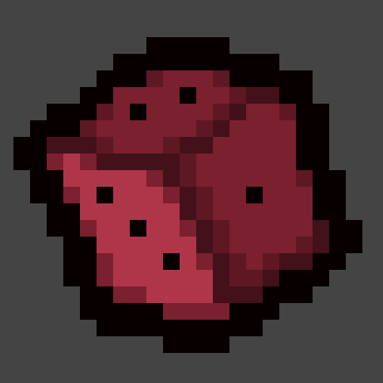
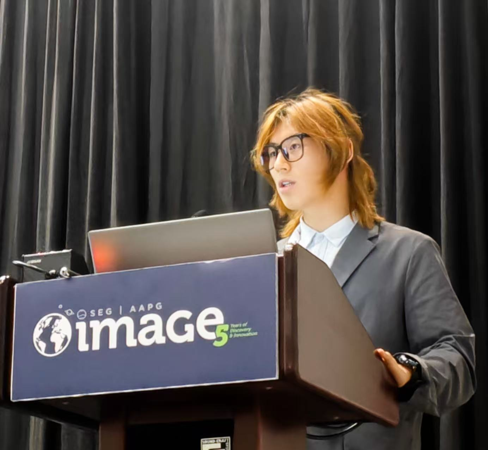
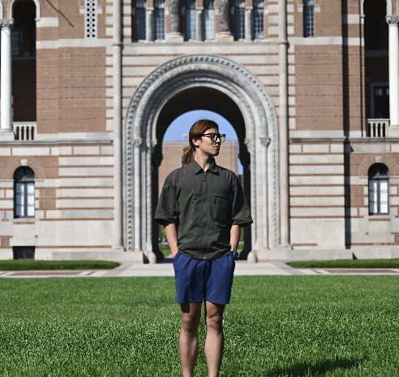
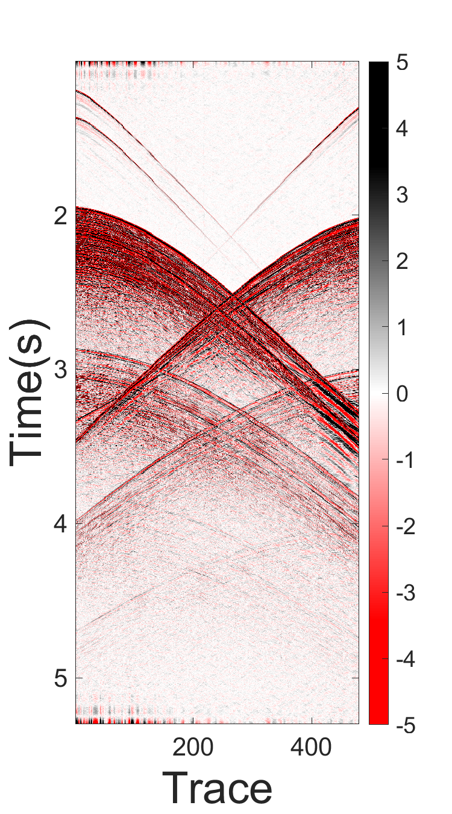
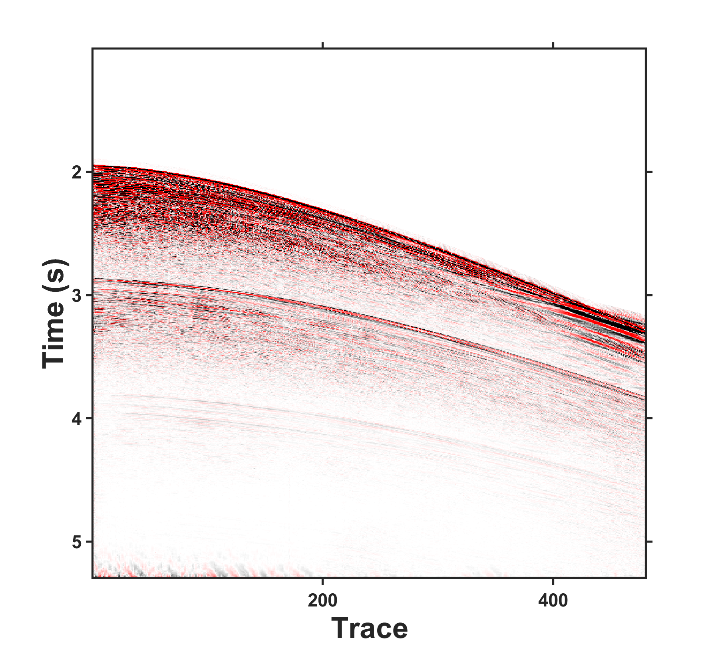
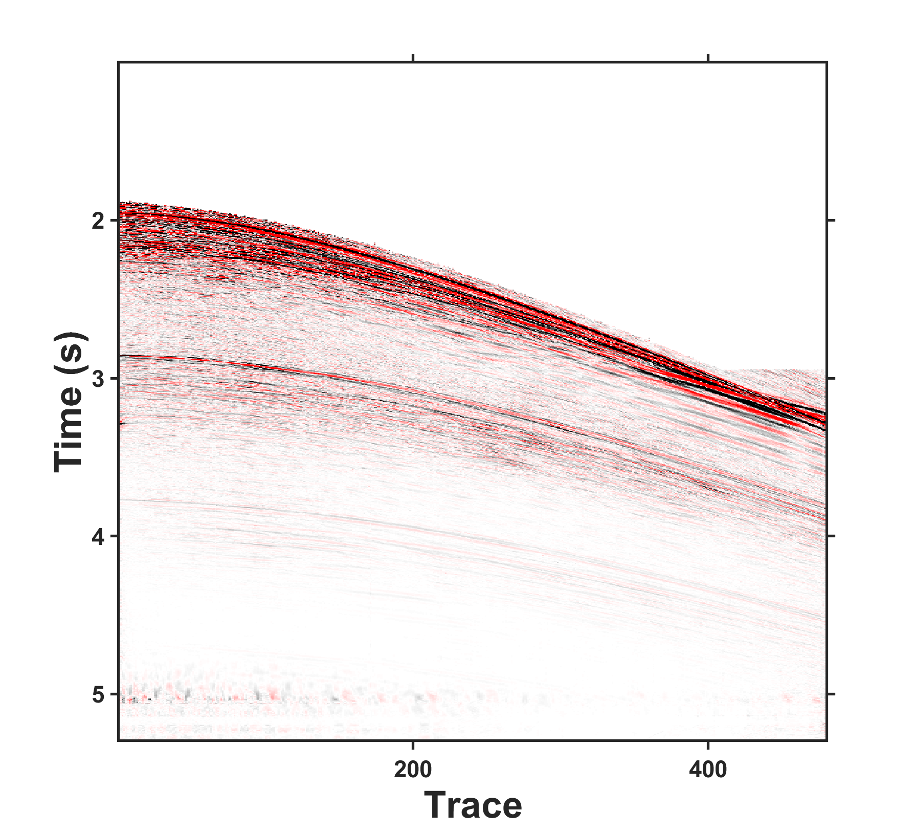
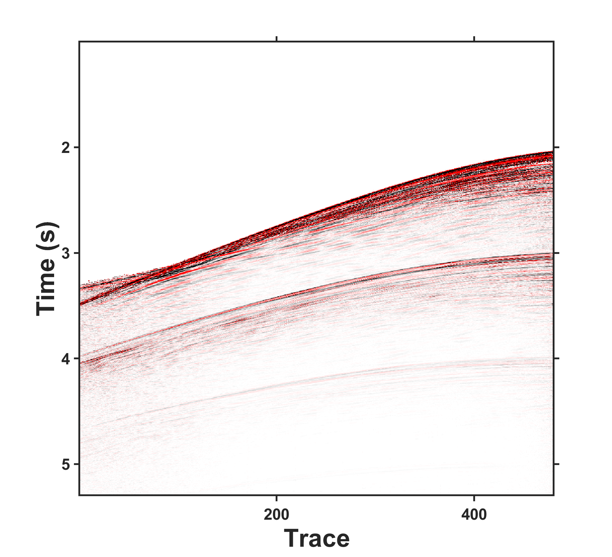
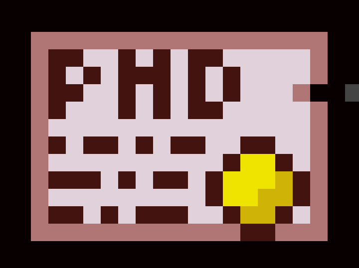
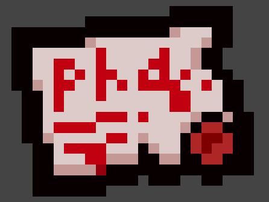
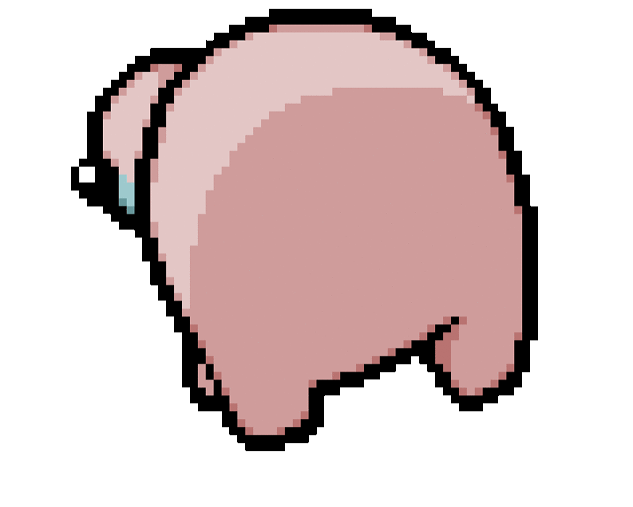

<link href="https://fonts.googleapis.com/css2?family=Permanent+Marker&display=swap" rel="stylesheet">
<link href="https://fonts.googleapis.com/css2?family=Ma+Shan+Zheng&display=swap" rel="stylesheet">

  
    👋 Hello everyone! I'm Isaac, and this is my good friend 
    
        
          Li Zifei (李子霏)
        
        <svg width="240" height="80" style="position: absolute; left: 50%; top: 0; transform: translateX(-50%); pointer-events: none; overflow: visible;">
            <g fill="none" stroke="#8b0000" stroke-width="3" stroke-linecap="round" stroke-linejoin="round">
                <path d="M15 38 C 40 40, 80 35, 120 38 C 160 41, 200 36, 225 39" />
                <path d="M121 65 C 118 55, 122 45, 120 38" /> <path d="M112 50 C 114 47, 117 44, 120 42" /> <path d="M128 49 C 125 46, 122 44, 120 42" /> </g>
            <text x="120" y="78" text-anchor="middle" font-family="'Permanent Marker', cursive" font-size="14" fill="#8b0000" font-weight="bold" transform="rotate(-2, 120, 78)">
                (FOOLISH!!!!!!!)
            </text>
        </svg>
    
    's GitHub introduction. That’s what the voices in the walls keep whispering, anyway. But don't mind them! Just like my basement, this profile is full of traps, treasures, and a lot of messy code. Zifei told me it was safe here, but I’m still keeping my D6  ready just in case we need to reroll some of these repositories.
  

 

<table width="100%" style="border-collapse: collapse; border: none; font-family: -apple-system, BlinkMacSystemFont, 'Segoe UI', Helvetica, Arial, sans-serif; background-color: #ffffff;">
  <tr>
    <td width="65%" style="vertical-align: top; padding-right: 25px;">
      <h2 style="margin: 0 0 10px 0; border: none; color: #24292e; font-size: 24px;">Zifei Li (李子霏)</h2>
      

        <i class="bi bi-mortarboard-fill"></i> <b style="color: #24292e;">PhD Candidate in Engineering</b> 
        Chengdu University of Technology | Department of Geophysics
      

      

      <table style="width: 100%; font-size: 14px; line-height: 1.8; color: #24292e;">
      <tr style="background-color: #ffffff">
          <td width="100px" style="color: #57606a;"><b>Birthday</b></td>
          <td style="color: #24292e;">2001.09.21</td>
        </tr>
      <tr style="background-color: #ffffff">
          <td style="color: #57606a;"><b>University</b></td>
          <td style="color: #24292e;">Chengdu University of Technology (CDUT)</td>
        </tr>
      <tr style="background-color: #ffffff">
          <td style="color: #57606a;"><b>Lab </b></td>
          <td style="color: #24292e;">State Key Laboratory of Oil and Gas Reservoir Geology and Exploitation</td>
        </tr>
      <tr style="background-color: #ffffff">
          <td style="color: #57606a;"><b>Email</b></td>
          <td><a href="mailto:Curvelet_lzf@163.com" style="color: #0969da; text-decoration: none;">Curvelet_lzf@163.com</a></td>
        </tr>
      <tr style="background-color: #ffffff">
          <td style="color: #57606a; vertical-align: top;"><b>Address</b></td>
          <td style="white-space: nowrap; color: #24292e;">No. 1, East 3rd Road, Erxianqiao, Chenghua District, Chengdu, China</td>
        </tr>
      </table>
      

        
          <b>Research Focus:</b> Simultaneous-source seismic acquisition and high-quality seismic imaging.
        
      

      

        
        
        
        
      

    </td>
    <td width="35%" align="center" style="vertical-align: top; background-color: #ffffff;">
      

          
          
      

    </td>
  </tr>
  <tr>
    <td colspan="2" align="center" style="padding-top: 35px; background-color: #ffffff;">
      

        
        
        
        
      

    </td>
  </tr>
</table>

---

### 📊 GitHub Stats 

  
  <!--  -->
  
  

 

### 🧬 About Me   
I am a Ph.D. candidate at the **Department of Geophysics, Chengdu University of Technology (CDUT)**. My research focuses on designing simultaneous-source seismic exploration techniques and high-quality seismic signal imaging. In the past few years, I've studied methods for separating and regularizing signals from sumul-sources. Currently, I'm attempting to integrate this with the design of observation systems to explore how pulse and controlled sources can increase the coherence difference between the effective signal and aliasing noise at the acquisition end, thereby expanding the application scope of simultaneous excitation seismic exploration techniques. Furthermore, how to achieve direct imaging of aliased data as much as possible, combining simultaneous-source data with processes such as RTM and FWI, is also one of my research directions.

* **🔍 Research Interests**: 
    * Simultaneous-source Seismic Acquisition (Deblending)
    * High-quality Seismic Imaging
    * Sparse Transforms (Curvelet, etc.) & Deep Learning in Geophysics

---

### 🎓 Education  
* **Ph.D. in Engineering (Candidate)** | Chengdu University of Technology | *2024 - Present*  (!)
* **B.Sc. in Science** | Chengdu University of Technology | *2020 - 2024*

---

<!-- 
 -->
  <h3 style="margin-top: 0; border: none; color: #24292e;">
    🏆 Competitions & Honors 
  </h3>
  
  <table width="100%" style="border-collapse: collapse; text-align: left; font-size: 14px; color: #24292e;">
    <thead>
      <tr style="background-color: #ffffff">
        <th style="padding: 10px; border: 1px solid #dfe2e5;">Contest</th>
        <th style="padding: 10px; border: 1px solid #dfe2e5;">Project</th>
        <th style="padding: 10px; border: 1px solid #dfe2e5;">Award</th>
      </tr>
    </thead>
    <tbody>
      <tr style="background-color: #ffffff">
        <td style="padding: 10px; border: 1px solid #dfe2e5;"><b>3rd Dongfang Cup</b></td>
        <td style="padding: 10px; border: 1px solid #dfe2e5;">Surface Wave Noise Suppression</td>
        <td style="padding: 10px; border: 1px solid #dfe2e5;">🥇 National 1st Prize</td>
      </tr>
      <tr style="background-color: #ffffff">
        <td style="padding: 10px; border: 1px solid #dfe2e5;"><b>2nd Dongfang Cup</b></td>
        <td style="padding: 10px; border: 1px solid #dfe2e5;">Post-Stack Structure-Preserving Filtering</td>
        <td style="padding: 10px; border: 1px solid #dfe2e5;">🥈 National 2nd Prize</td>
      </tr>
      <tr style="background-color: #ffffff">
        <td style="padding: 10px; border: 1px solid #dfe2e5;"><b>1st Dongfang Cup</b></td>
        <td style="padding: 10px; border: 1px solid #dfe2e5;">Fault Prediction Algorithm</td>
        <td style="padding: 10px; border: 1px solid #dfe2e5;">🥇 National 1st Prize</td>
      </tr>
    </tbody>
  </table>

  <blockquote style="margin: 15px 0 0 0; padding: 10px; background: #fff9c4; border-left: 5px solid #fbc02d; color: #4b3832; font-size: 13px;">
    <b>Scholarships:</b> Ph.D. Motivational Scholarship (Special Class), Academic Scholarship (1st Class).
  </blockquote>
<!-- 
 -->

---

### 📝 Publications & Conferences  
#### 📄 Publications
- **[J]** *Seismic random noise attenuation using structure-oriented 3D curvelet transform.*
- **[J]** *Iterative deblending based on 2D-FFT with multistage median bilateral filtering.*
- **[C]** *Self-supervised Training for Simultaneous Interpolation and Deblending of Blended Data.* 

#### 🌐 Conferences
* **IMAGE** (International Meeting for Applied Geosciences & Energy)
* **CGU** (China Union of Geological Sciences Annual Conference)
* **AGER** (First Frontier Forum on Earth Energy)

---

### 🛠 Tech Stack 

  
  
  
  <!--  -->
  

---

### 📫 Get in touch 
- **Institutional Email**: `2024010196@stu.cdut.edu.cn`
- **Personal Email**: `Curvelet_lzf@163.com`

  

